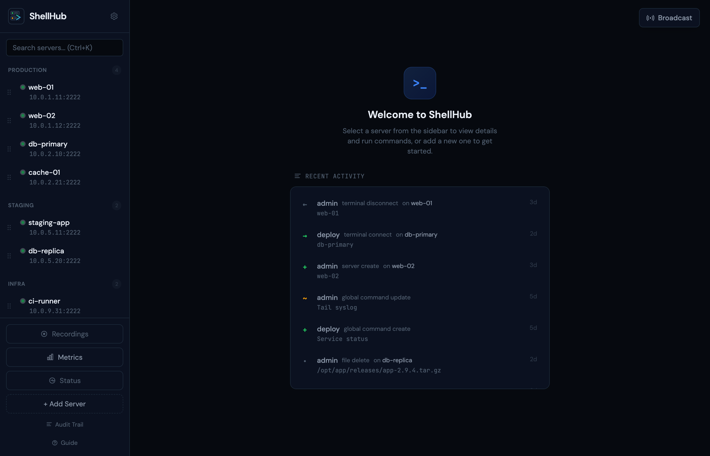
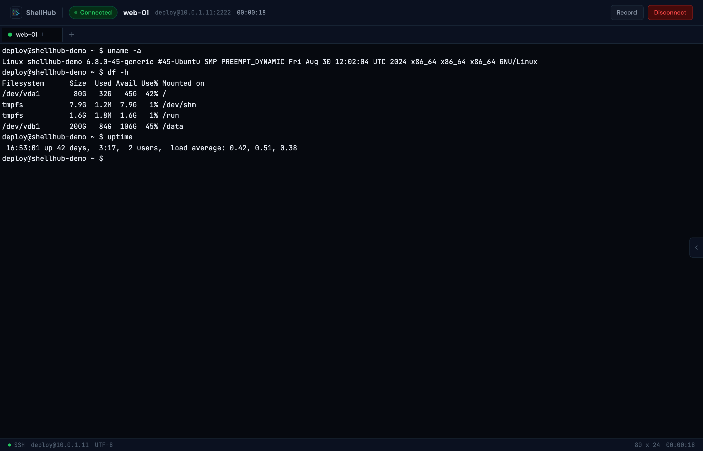
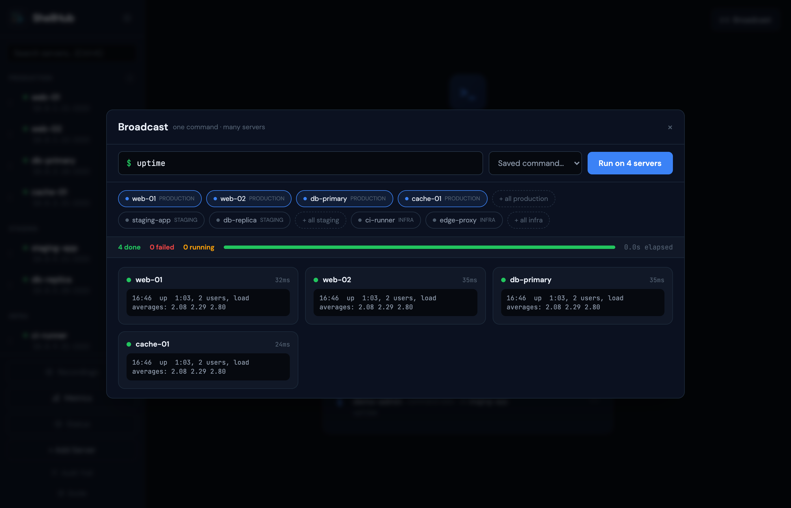
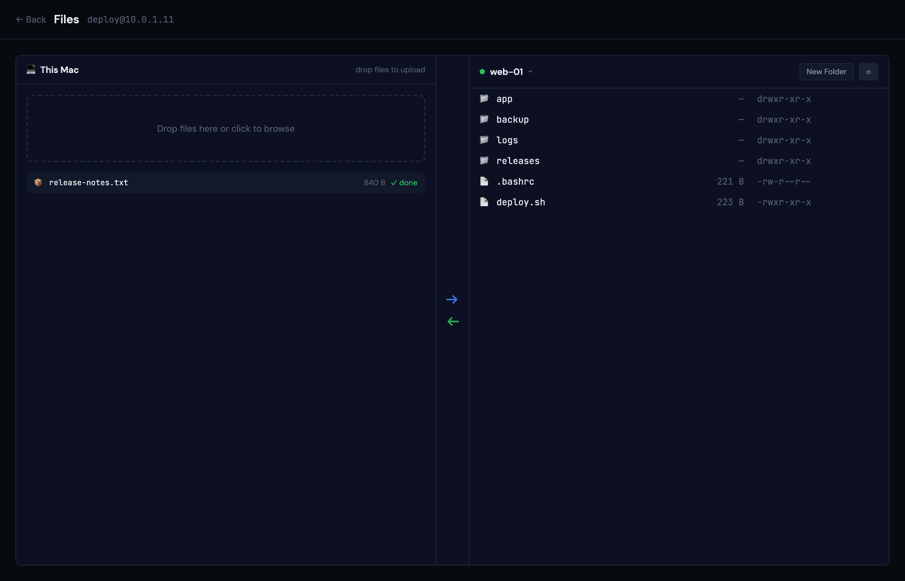
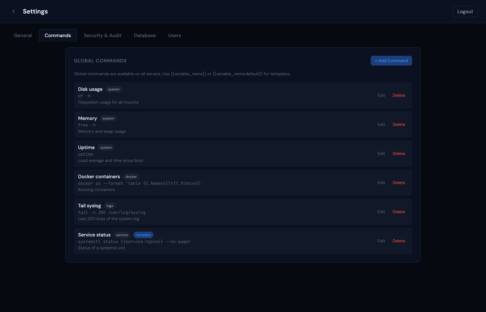
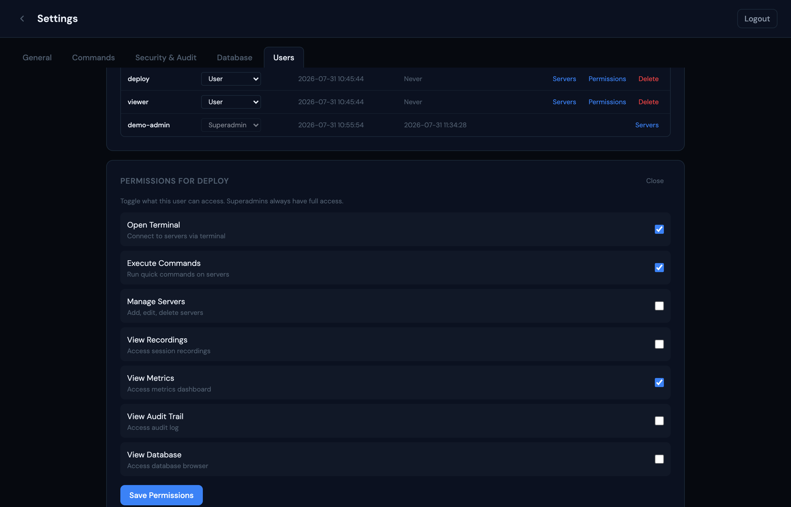
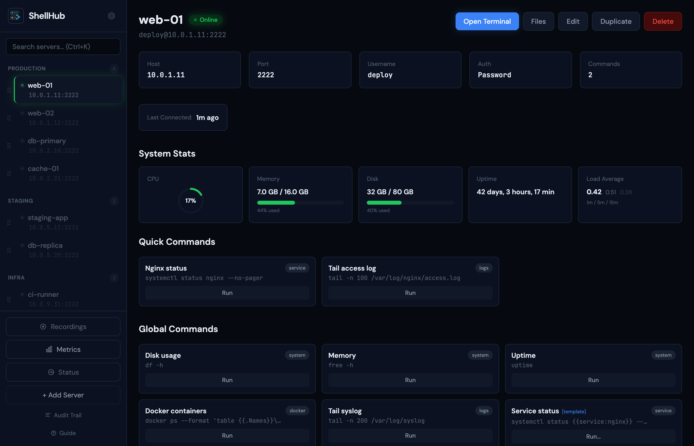
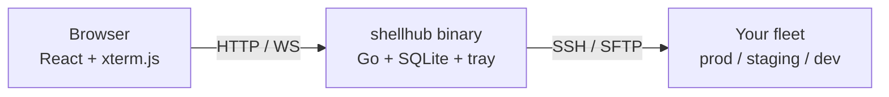

<p align="center">
  
</p>

<p align="center">
  
  
  
  
  
</p>

<p align="center">
  <a href="#quick-start">Quick Start</a> ·
  <a href="#features">Features</a> ·
  <a href="#how-it-works">How it works</a> ·
  <a href="#api-endpoints">API</a> ·
  <a href="#cross-platform-builds">Builds</a>
</p>

A lightweight web-based SSH client and server management tool. Connect to your servers, run commands, browse files, and manage quick shortcuts — all from the browser. Built with Go and React, it ships as a single self-contained binary with system tray support.

<p align="center">
  
</p>



Server dashboard with live status, quick commands, and activity feed.

## Features

<!-- Web Terminal -->
<table>
<tr>
<td width="52%">



</td>
<td width="48%">

### Web Terminal

Full xterm.js terminal in the browser — no local SSH client needed.

- Multi-tab sessions (`Ctrl+T` open, `Ctrl+W` close, `Ctrl+1-9` switch)
- Scrollback search with regex, case sensitivity, and match navigation (`Ctrl+F`)
- Session recording in asciicast v2 format, with a built-in player (play/pause, 0.5x-4x speed, seek, idle-skip)
- Copy-on-select and smart `Ctrl+C` (copies when text is selected, sends SIGINT otherwise)
- Password and SSH private-key authentication

</td>
</tr>
</table>

<!-- Broadcast -->
<table>
<tr>
<td width="48%">

### Broadcast

One command, the whole fleet. Pick targets by group and watch every server report back live.

- Target chips grouped by environment, one-click "all PROD"
- Live per-server cards showing output, exit code, and duration
- Fleet summary meter: done / failed / running
- `{{variable}}` template values resolved per server

</td>
<td width="52%">



</td>
</tr>
</table>

<!-- SFTP File Browser -->
<table>
<tr>
<td width="52%">



</td>
<td width="48%">

### SFTP File Browser

Dual-pane file manager over your existing SSH connection, powered by `github.com/pkg/sftp`.

- Drag files from your desktop straight to the server
- Per-file upload progress, streamed downloads
- Breadcrumb navigation, permissions at a glance, create directories
- Every upload, download, and delete is audited

</td>
</tr>
</table>

<!-- Quick Commands -->
<table>
<tr>
<td width="48%">

### Quick Commands

Save the commands you run every day — flush cache, restart service, tail logs — and fire them in one click.

- Per-server and global commands with tags
- `{{variable}}` and `{{variable:default}}` templates
- Built-in variables auto-resolve: `{{hostname}}`, `{{username}}`, `{{port}}`, `{{date}}`, `{{server_name}}`
- Re-run from the output modal with a live running indicator
- Destructive-command confirmation guard (`rm -rf`, `drop`, etc.)

</td>
<td width="52%">



</td>
</tr>
</table>

<!-- Real Access Control -->
<table>
<tr>
<td width="52%">



</td>
<td width="48%">

### Real Access Control

Per-user permissions enforced by the API, not hidden by the UI.

- 7 permission flags per user plus per-server assignment
- 4h sliding sessions with server-side revocation on logout and password change
- Command text redacted from users without audit access
- Full audit trail: who ran what, on which server, when

</td>
</tr>
</table>

<!-- Monitoring & Metrics -->
<table>
<tr>
<td width="48%">

### Monitoring & Metrics

Know your fleet's state before anyone files a ticket.

- Live CPU / memory / disk / load average widgets per server
- Uptime %, latency, and activity charts (24h / 7d / 30d)
- Background ping with a configurable interval, recorded to ping history
- Lightweight CSS/SVG charts — zero external charting libraries

</td>
<td width="52%">



</td>
</tr>
</table>

## How it works

One binary. The React UI is embedded in the Go server; everything talks SSH from there.



## Quick Start

Download the build for your platform, then run it:

```
./shellhub          # opens http://localhost:8080
```

On first launch:

1. A folder picker dialog asks where to store your data
2. ShellHub binds to **http://localhost:8080** (auto-falls-back to 8081, 8082, ... if 8080 is busy)
3. Your browser opens automatically to the dashboard
4. **Sign in with the default superadmin account:**
   - **Username:** `admin`
   - **Password:** `admin123`
   - **Change this immediately** from **Settings → Security**
5. A tray icon appears — right-click for *Open in Browser* / *Stop Server*

Add servers from the browser. Everything is stored in `shellhub.db` in the folder you chose.

```
your-chosen-folder/
└── shellhub.db      ← auto-created, stores all server configs

%APPDATA%\ShellHub\  (Windows) or ~/.config/shellhub/ (Linux/macOS)
└── settings.json    ← remembers your chosen DB location + port
```

<details>
<summary><b>macOS</b> — DMG install, Gatekeeper note</summary>

1. Download `ShellHub.dmg` and double-click to mount it.
2. Drag **ShellHub.app** into your **Applications** folder.
3. These builds are not code-signed, so Gatekeeper will block the first open. Right-click (or Control-click) **ShellHub.app** and choose **Open**, then confirm **Open** in the dialog. macOS remembers the choice on later launches.
4. On first run, pick a folder for `shellhub.db` when prompted.

Settings live at `~/.config/shellhub/settings.json` (or `$XDG_CONFIG_HOME/shellhub/settings.json` if that variable is set).

</details>

<details>
<summary><b>Windows</b> — installer or portable exe</summary>

**Installer:** run `ShellHub-Setup.exe` (NSIS). It installs ShellHub and creates Start Menu and desktop shortcuts.

**Portable:** download `shellhub-windows-amd64.exe` and run it directly — no install needed.

SmartScreen may warn on the unsigned build. Click **More info → Run anyway** to continue. On first run, pick a folder for `shellhub.db` when prompted.

Settings live at `%APPDATA%\ShellHub\settings.json` (typically `C:\Users\<you>\AppData\Roaming\ShellHub\settings.json`).

</details>

<details>
<summary><b>Linux</b> — deb / rpm / raw binary</summary>

**Debian / Ubuntu:**

```bash
sudo dpkg -i shellhub_0.2.0_amd64.deb
shellhub
```

**Fedora / RHEL / openSUSE:**

```bash
sudo rpm -i shellhub-0.2.0.x86_64.rpm
shellhub
```

**Raw binary:**

```bash
chmod +x shellhub-linux-amd64
./shellhub-linux-amd64
```

The system tray icon uses the standard `libappindicator` / GTK stack. On minimal or headless installs those libraries may be absent — ShellHub still serves the web UI, only the tray icon is skipped. Settings live at `~/.config/shellhub/settings.json` (or `$XDG_CONFIG_HOME/shellhub/settings.json`).

</details>

<details>
<summary><b>From source</b> — Go 1.22+, Node 18+</summary>

Prerequisites: **Go 1.22+** and **Node 18+**.

```bash
# Windows (PowerShell)
cd build
./build.ps1 build

# Linux / macOS
cd build
make build
```

**Development mode** — run the Go backend and Vite dev server separately for hot reload:

```bash
# Terminal 1: Go backend (console mode, no tray, no folder picker)
go run . -dev

# Terminal 2: React frontend (proxies API to :8080)
cd frontend && npm run dev
```

Open `http://localhost:5173` for the frontend with hot reload.

</details>

One self-contained binary — frontend embedded, SQLite storage, system tray.

## Changing the port

Pick any of the following — all of them persist for future launches:

```bash
# Option 1: pass -port once, it gets saved to settings.json
shellhub -port 9000

# Option 2: edit settings.json directly
# %APPDATA%\ShellHub\settings.json   (Windows)
# ~/.config/shellhub/settings.json   (Linux/macOS)
{
  "db_path": "C:\\Users\\me\\ShellHub\\shellhub.db",
  "port": 9000
}
```

If the chosen port is in use, ShellHub automatically picks the next free port in the range `[port, port+20]` and saves it. The current URL is shown in the tray tooltip and as a disabled menu entry.

## Import from YAML (optional)

If you have existing server configs, place a `servers.yaml` next to the database before first run:

```bash
cp servers.example.yaml servers.yaml
vim servers.yaml   # fill in your real servers
./shellhub         # auto-imports into SQLite on first start
```

The YAML is only read once — when the database is empty. After import, all changes go through the web UI into SQLite.

```yaml
servers:
  - name: "Production AEM"
    host: "10.0.1.50"
    port: 22
    username: "admin"
    password: "changeme"
    group: "Production"
    auth_type: "password"          # or "key" for SSH key auth
    private_key: ""                # PEM-encoded private key (when auth_type is "key")
    quick_commands:
      - name: "Flush Cache"
        command: "sudo /opt/aem/crx-quickstart/bin/flush-cache.sh"
        tag: "cache"
      - name: "Restart Apache"
        command: "sudo systemctl restart apache2"
        tag: "service"
```

See `servers.example.yaml` for a full example with multiple servers.

> **Note:** `servers.yaml` and `shellhub.db` contain credentials and are gitignored.

## Themes

Six color themes, switchable instantly from **Settings → General** (the choice is persisted).

| Theme | Description |
|-------|-------------|
| dark | Default deep-navy dark theme with blue and green accents |
| midnight | Near-black background with indigo accents for low-light rooms |
| light | Clean high-contrast light theme for bright environments |
| nord | Muted arctic blue-grey palette from the Nord scheme |
| dracula | Warm purple-and-pink dark theme from the Dracula scheme |
| matrix | High-contrast black-and-green terminal look |

## User Roles & Permissions

| Permission | Superadmin | Default User |
|------------|:----------:|:------------:|
| Open Terminal | Yes | Yes |
| Execute Commands | Yes | Yes |
| Manage Servers | Yes | No |
| View Recordings | Yes | No |
| View Metrics | Yes | No |
| View Audit Trail | Yes | No |
| View Database | Yes | No |
| Manage Users | Yes | No |

Superadmin can toggle any permission per user from **Settings → Users → Permissions**. The first user is auto-promoted to superadmin with full access.

Permission flags are enforced server-side by API middleware (403 on denial) — metrics, audit, recordings, database browser, command execution, file access, and terminal access are all gated in the API, not just hidden in the UI. Regular users only see servers assigned to them by the superadmin. File-browser access is gated by the Open Terminal permission.

Sessions are HMAC-SHA256 tokens in httpOnly cookies with 4h sliding expiry (auto-renewed while active, re-login after 4h idle); server-side revocation invalidates sessions on logout and password change.

## Settings

Access settings via the gear icon in the sidebar or navigate to `/settings`.

**General:**
- Ping Interval — how often to check server online/offline status (default: 30 minutes)
- Theme — choose dark, midnight, light, nord, dracula, or matrix (applied instantly, persisted)
- Export/Import — backup and restore server configs as JSON

**Commands:**
- Global Commands — create, edit, delete commands shared across all servers
- Template Support — mark commands as templates with variable placeholders

**Security:**
- Change Password — update your own password
- Login Attempts — view all login attempts with success/failure status
- Security Info — overview of encryption and auth measures in place

**Database** (requires View Database permission):
- Browse all SQLite tables
- View rows with pagination

**Users** (superadmin only):
- Create/delete users
- Change roles (superadmin/user)
- Set granular permissions per user
- Assign server access per user

## Storage

On first launch, ShellHub asks you to pick a folder for the database. The choice is saved to `settings.json` in your OS config directory (`%APPDATA%\ShellHub` on Windows, `~/.config/shellhub` on Linux/macOS) and remembered on restart.

You can override the DB location with the `-db` flag:

```bash
./shellhub -db /path/to/my/shellhub.db
```

Server passwords and SSH keys are encrypted at rest with AES-256-GCM. Accounts are locked after 5 failed login attempts in 10 minutes (auto-unlock after 30 minutes). All login attempts are logged with IP and user agent.

## API Endpoints

### Authentication
| Method | Path | Description |
|--------|------|-------------|
| GET | `/api/auth/status` | Auth status check |
| POST | `/api/auth/login` | Login |
| POST | `/api/auth/register` | Register (first user only) |
| POST | `/api/auth/logout` | Logout |
| GET | `/api/auth/me` | Get current user info + permissions |
| PUT | `/api/auth/password` | Change own password |

### User Management (superadmin)
| Method | Path | Description |
|--------|------|-------------|
| GET | `/api/users` | List all users |
| POST | `/api/users` | Create user |
| DELETE | `/api/users/{id}` | Delete user |
| PUT | `/api/users/{id}/role` | Update user role |
| GET | `/api/users/{id}/servers` | Get assigned servers |
| PUT | `/api/users/{id}/servers` | Set assigned servers |
| PUT | `/api/users/{id}/permissions` | Update user permissions |

### Servers
| Method | Path | Description |
|--------|------|-------------|
| GET | `/api/servers` | List servers (filtered by access) |
| POST | `/api/servers` | Create server |
| PUT | `/api/servers/{id}` | Update server |
| DELETE | `/api/servers/{id}` | Delete server |
| PUT | `/api/servers/reorder` | Reorder servers |
| POST | `/api/servers/{id}/ping` | Check server online status |
| POST | `/api/servers/{id}/exec` | Execute command on server |
| GET | `/api/servers/{id}/stats` | Get live server stats |
| GET | `/api/servers/{id}/history` | Connection history |
| GET | `/api/servers/{id}/exec-history` | Execution history |

### Files (SFTP)
| Method | Path | Description |
|--------|------|-------------|
| GET | `/api/servers/{id}/files` | List directory contents |
| GET | `/api/servers/{id}/files/download` | Download a file |
| POST | `/api/servers/{id}/files/upload` | Upload files (multipart) |
| DELETE | `/api/servers/{id}/files` | Delete a file or directory |
| POST | `/api/servers/{id}/files/mkdir` | Create a directory |

### Commands & Audit
| Method | Path | Description |
|--------|------|-------------|
| GET | `/api/global-commands` | List global commands |
| POST | `/api/global-commands` | Create global command |
| PUT | `/api/global-commands/{id}` | Update global command |
| DELETE | `/api/global-commands/{id}` | Delete global command |
| GET | `/api/exec-history` | Full exec history (paginated) |
| GET | `/api/exec-history/export` | Export exec history as CSV |
| GET | `/api/audit-log` | Audit log entries |

### Recordings & Metrics
| Method | Path | Description |
|--------|------|-------------|
| GET | `/api/recordings` | List session recordings |
| GET | `/api/recordings/{id}` | Get recording with data |
| DELETE | `/api/recordings/{id}` | Delete recording |
| GET | `/api/metrics` | Metrics dashboard data |

### Admin
| Method | Path | Description |
|--------|------|-------------|
| GET | `/api/db/tables` | List database tables |
| GET | `/api/db/query` | Query table data |
| GET | `/api/settings` | Get app settings |
| PUT | `/api/settings` | Update settings |
| GET | `/api/export` | Export all data as JSON |
| POST | `/api/import` | Import data from JSON |

### WebSocket
| Method | Path | Description |
|--------|------|-------------|
| WS | `/api/terminal/{id}` | Interactive terminal session |

## Cross-Platform Builds

ShellHub uses pure-Go SQLite (no CGO), so cross-compilation works out of the box. Windows builds include `-H windowsgui` to hide the console window and embed the application icon.

All build scripts live in the `build/` directory:

**PowerShell (Windows):**

```powershell
cd build
./build.ps1 build-all       # all 5 platforms
./build.ps1 windows         # build/dist/shellhub-windows-amd64.exe
./build.ps1 linux           # build/dist/shellhub-linux-amd64
./build.ps1 linux-arm       # build/dist/shellhub-linux-arm64
./build.ps1 mac             # build/dist/shellhub-darwin-amd64
./build.ps1 mac-arm         # build/dist/shellhub-darwin-arm64
```

**Bash (Linux / macOS):**

```bash
cd build
make build-all              # all 5 platforms
make build-windows          # build/dist/shellhub-windows-amd64.exe
make build-linux            # build/dist/shellhub-linux-amd64
make build-linux-arm        # build/dist/shellhub-linux-arm64
make build-mac              # build/dist/shellhub-darwin-amd64
make build-mac-arm          # build/dist/shellhub-darwin-arm64
```

Cross-platform binaries land in `build/dist/`. Each is a self-contained single file.

## CLI Flags

| Flag | Default | Description |
|------|---------|-------------|
| `-port` | `8080` | HTTP server port |
| `-db` | `shellhub.db` | Path to the SQLite database file (overrides saved setting) |
| `-dev` | `false` | Development mode (console output, no tray, no folder picker) |
| `-version` | — | Print the ShellHub version and exit |

## Tech Stack

**Backend:** Go 1.25, net/http, gorilla/websocket, golang.org/x/crypto/ssh, github.com/pkg/sftp, modernc.org/sqlite, getlantern/systray, sqweek/dialog

**Frontend:** React 19, TypeScript, Vite, Tailwind CSS, xterm.js, @xterm/addon-search, React Router, @dnd-kit

## Project Structure

```
shellhub/
├── main.go                 # Entry point, routing, background ping, embedded frontend
├── servers.example.yaml    # Example config for YAML import
├── assets/
│   ├── shellhub.ico        # Application icon source
│   ├── banner.svg          # README hero banner
│   └── demo.svg            # Animated startup demo
├── build/
│   ├── build.ps1           # PowerShell build script (Windows)
│   ├── Makefile            # Make build script (Linux/macOS)
│   └── dist/               # Cross-platform binaries (gitignored)
├── internal/
│   ├── auth/               # Authentication, RBAC, encryption, permissions
│   ├── config/             # SQLite store, schema, migrations, CRUD
│   ├── settings/           # Persisted app settings (DB path, port)
│   ├── ssh/                # SSH client (password + key auth)
│   ├── api/                # REST handlers, stats, metrics, DB browser
│   │   └── sftp.go         # SFTP file browser handlers
│   ├── terminal/           # WebSocket ↔ SSH bridge with recording
│   └── tray/               # System tray icon + menu
└── frontend/
    └── src/
        ├── pages/          # Dashboard, Terminal, Files, Settings, Login, Audit, Recordings, Metrics
        ├── components/     # Sidebar, TabBar, TerminalSearch, ServerStatsWidget, BroadcastModal, etc.
        └── lib/            # API client, types, auth context, templates, WebSocket
```
