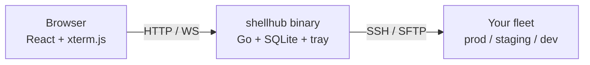

<p align="center">
  
</p>

<p align="center">
  
  
  
  
  
</p>

<p align="center">
  <a href="#quick-start">Quick Start</a> ·
  <a href="#features">Features</a> ·
  <a href="#how-it-works">How It Works</a> ·
  <a href="docs/DOCUMENTATION.md">Documentation</a>
</p>

A lightweight web-based SSH client and server management tool. Connect to your servers, run commands, browse files, and keep your everyday shortcuts one click away — all from the browser. Built with Go and React, it ships as a single self-contained binary with system tray support.

<p align="center">
  
</p>


Server dashboard with live status, quick commands, and activity feed.

## Features

<!-- Web Terminal -->
<table>
<tr>
<td width="52%">


</td>
<td width="48%">

### Web Terminal

Full xterm.js terminal in the browser — no local SSH client needed.

- Multi-tab sessions (`Ctrl+T` open, `Ctrl+W` close, `Ctrl+1-9` switch)
- Scrollback search with regex, case sensitivity, and match navigation (`Ctrl+F`)
- Session recording in asciicast v2 format, with a built-in player (play/pause, 0.5x-4x speed, seek, idle-skip)
- Copy-on-select and smart `Ctrl+C` (copies when text is selected, sends SIGINT otherwise)
- Password and SSH private-key authentication

</td>
</tr>
</table>

<!-- Broadcast -->
<table>
<tr>
<td width="48%">

### Broadcast

One command, the whole fleet. Pick targets by group and watch every server report back live.

- Target chips grouped by environment, one-click "all PROD"
- Live per-server cards showing output, exit code, and duration
- Fleet summary meter: done / failed / running
- `{{variable}}` template values resolved per server

</td>
<td width="52%">


</td>
</tr>
</table>

<!-- SFTP File Browser -->
<table>
<tr>
<td width="52%">


</td>
<td width="48%">

### SFTP File Browser

Dual-pane file manager over your existing SSH connection, powered by `github.com/pkg/sftp`.

- Drag files from your desktop straight to the server
- Per-file upload progress, streamed downloads
- Breadcrumb navigation, permissions at a glance, create directories
- Every upload, download, and delete is audited

</td>
</tr>
</table>

<!-- Quick Commands -->
<table>
<tr>
<td width="48%">

### Quick Commands

Save the commands you run every day — flush cache, restart service, tail logs — and fire them in one click.

- Per-server and global commands with tags
- `{{variable}}` and `{{variable:default}}` templates
- Built-in variables auto-resolve: `{{hostname}}`, `{{username}}`, `{{port}}`, `{{date}}`, `{{server_name}}`
- Re-run from the output modal with a live running indicator
- Destructive-command confirmation guard (`rm -rf`, `drop`, etc.)

</td>
<td width="52%">


</td>
</tr>
</table>

<!-- Real Access Control -->
<table>
<tr>
<td width="52%">


</td>
<td width="48%">

### Real Access Control

Per-user permissions enforced by the API, not hidden by the UI.

- Per-user permission flags plus per-server assignment
- 4h sliding sessions with server-side revocation on logout and password change
- Command text redacted from users without audit access
- Full audit trail: who ran what, on which server, when

</td>
</tr>
</table>

<!-- Monitoring & Metrics -->
<table>
<tr>
<td width="48%">

### Monitoring & Metrics

Know your fleet's state before anyone files a ticket.

- Live CPU / memory / disk / load average widgets per server
- Uptime %, latency, and activity charts (24h / 7d / 30d)
- Background ping with a configurable interval, recorded to ping history
- Lightweight CSS/SVG charts — zero external charting libraries

</td>
<td width="52%">


</td>
</tr>
</table>

## How It Works

One binary. The React UI is embedded in the Go server, and everything talks SSH from there.



## Quick Start

One-line install:

```bash
# macOS / Linux
curl -fsSL https://raw.githubusercontent.com/shivarchit/shellhub/main/install.sh | sh
```

```powershell
# Windows (PowerShell)
irm https://raw.githubusercontent.com/shivarchit/shellhub/main/install.ps1 | iex
```

Or manually:

1. Download the build for your platform from the [latest release](https://github.com/shivarchit/shellhub/releases) — macOS `.dmg`, Windows installer or portable `.exe`, Linux `.deb` / `.rpm` / raw binary.
2. Run it:

   ```bash
   ./shellhub          # opens http://localhost:8080
   ```

3. Pick a folder for your data when the dialog appears — everything lands in `shellhub.db` there.
4. Your browser opens to the dashboard. Sign in with the default superadmin account:
   - **Username:** `admin`
   - **Password:** `admin123`
   - **Change this immediately** from **Settings → Security**
5. A tray icon appears — right-click for *Open in Browser* / *Stop Server*.

Add your servers from the browser and you are done. If port 8080 is busy, ShellHub falls back to the next free port and remembers it.

**Full documentation: [docs/DOCUMENTATION.md](docs/DOCUMENTATION.md)** — per-OS install notes (Gatekeeper, SmartScreen, deb/rpm), building from source, changing the port, YAML import, themes, roles and permissions, settings, storage, API reference, and CLI flags.
